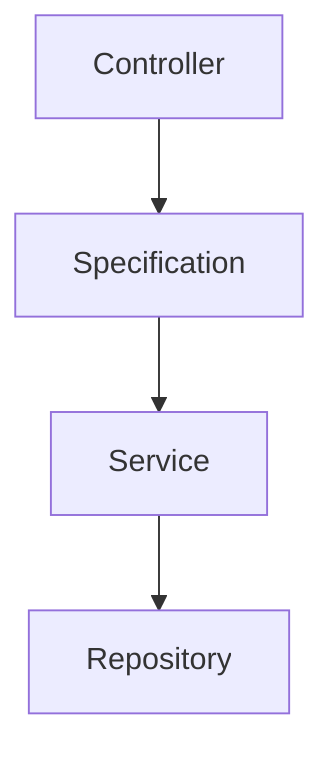

# Documentação do Projeto

## Regra de Negócio
Projeto para gerenciamento de cinema, com funcionalidades como compra de ingressos e gestão de salas, incluindo organização de assentos e sessões de filmes.

## Tecnologias
- C#, ASP.NET Core, PostgreSQL, Redis, Entity Framework, xUnit e Docker

## Padrões de Design
- DDD, SOLID, Factory e Notification  

## Arquitetura
Monolítica com Clean Architecture, garantindo modularidade e separação de responsabilidades.

# Separação do Projeto

## Camada Api

### Controllers
Contém as controllers responsáveis por gerenciar as requisições e respostas da aplicação, servindo como ponto de entrada para os endpoints.

### Filters
Armazena a configuração dos filters, que gerenciam exceções e fornecem um tratamento consistente para erros no projeto.

### Middlewares
Configuração exclusiva para políticas de CORS, permitindo controlar o acesso de origens externas à API.

### Versioning
Contém a configuração de versionamento, permitindo gerenciar diferentes versões da API de forma organizada.

## Camada Application

### DependencyInjection
Configuração dos serviços de injeção de dependência para garantir a resolução correta das classes na camada application.

### Dtos
Definição dos Data Transfer Objects (DTOs) para transferência de dados entre as camadas de forma estruturada e segura.

### Factory
Mapeamento entre as entidades e os DTOs, facilitando a conversão de dados para comunicação entre as camadas.

### Interfaces
Interfaces que definem as operações e métodos utilizados na camada application, garantindo flexibilidade e desacoplamento.

### Services
Implementação das regras de negócio, onde são realizadas as operações principais da aplicação.

### Specification
Validação e tratamento inicial dos dados, assegurando que atendem aos critérios definidos antes de seguir para o processamento.

## Camada Domain

### Entities
Agrupa as entidades que representam os objetos principais de negócio, com suas propriedades e comportamentos.

### Enums
Fornece listas de valores fixos usados para categorizar e organizar informações de forma consistente no sistema.


## Camada Infrastructure

### Cache


### Context  
Define o contexto de banco de dados, responsável pela comunicação com o armazenamento e o mapeamento das entidades.

### DependencyInjection  
Configuração dos serviços de injeção de dependência para garantir a resolução correta das classes na camada infrastructure.

### FiltersModels  
Contém os modelos utilizados para aplicação de filtros em consultas, facilitando a criação de critérios dinâmicos.

### FunctionsDatabase  
Define funções personalizadas para serem usadas no Entity Framework, otimizando operações no banco de dados.

### Interfaces  
Interfaces que definem as operações e métodos utilizados na camada infrastructure, garantindo flexibilidade e desacoplamento.

### Mappings  
Gerencia o mapeamento entre as entidades do domínio e as tabelas do banco de dados.

### Migrations  
Armazena as migrações para versionamento e atualização da estrutura do banco de dados.

### Notifications  
Implementa o design pattern Notification, centralizando a configuração e uso de notificações para permitir a criação de exceções personalizadas e consistentes em todo o projeto.

### Repositories  
Implementa os padrões de repositório para acesso e manipulação de dados no banco.


## Tests
Contém todos os testes unitários do projeto, desenvolvidos utilizando o framework xUnit para validar as funcionalidades de forma isolada.

## .github/workflows 
Contém as configurações para os pipelines de CI/CD do projeto, automatizando processos como build, execução de testes e criação de imagens Docker.


## Diagrama do Banco


## Diagrama da Requisição



Para subir a aplicação com Docker Compose, execute o comando abaixo na raiz do projeto:

```bash
docker-compose up
```
